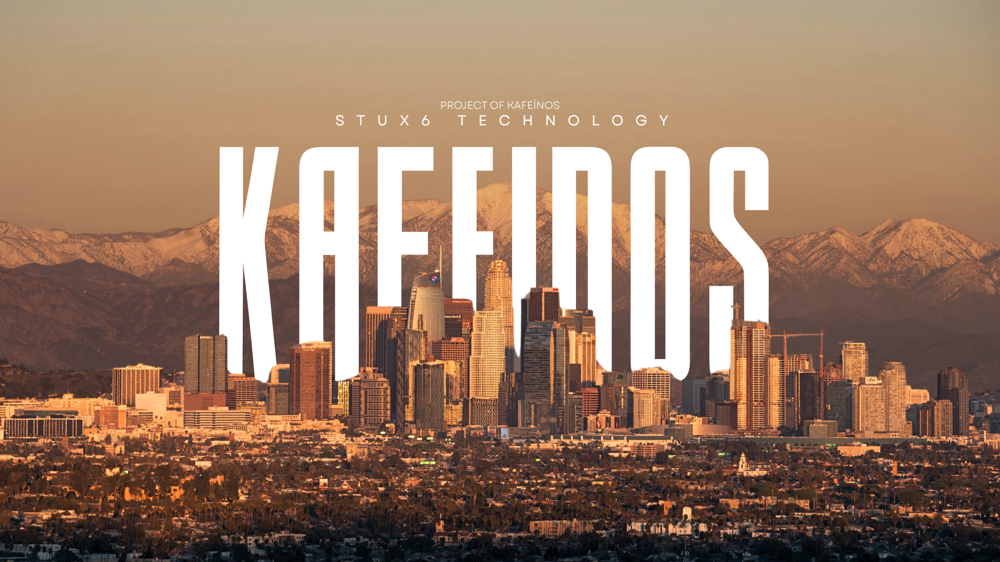

  

# KafeinOS
CaffeineOS is a DOS-like operating system based on the FAT16 file system, built entirely from scratch by a volunteer team one night out of pure boredom. ;)

KafeinOS is a 16-bit real mode operating system for x86-compatible PCs, 
written entirely in assembly language, which boots from a floppy disk,
CD-ROM or USB key. It features a text-based dialog-driven user
interface, a command-line, support for FAT12 (MS-DOS-like) floppy
disks, sound (PC speaker), text editor, BASIC interpreter and more.
The kernel includes over 60 system calls.

KafeinOS is a learning tool for those wishing to understand simple OS 
construction and x86 assembly. Quick getting-started guide: kafeinOS can 
run from a floppy disk or CD-ROM, either on an emulator or a real PC. 
See the disk_images/ directory for files that you can write to the 
appropriate media or boot in, for instance, VMware, QEMU or VirtualBox.

## Developer Team

- **Alperen ERKAN:** Lead developer responsible for project/code frameworks, base references and DOS structures.

- **Muhammed Ekrem GÜLER:** An assistant engineer responsible for secondary tasks such as code base development, structural adjustments, and the implementation and testing of applications and Ring-3 architectures, etc.
